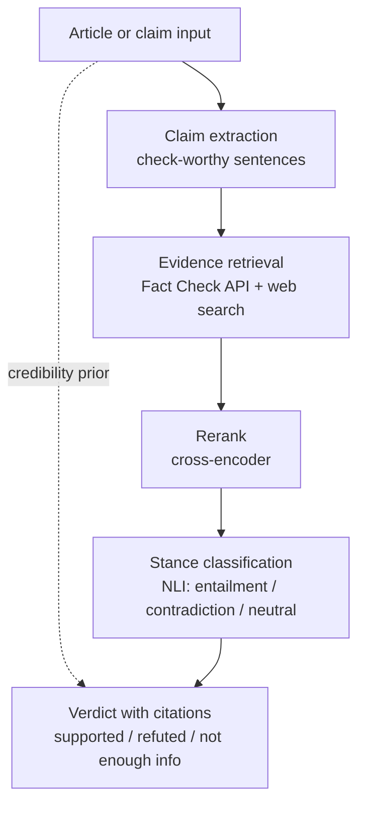

        # Debunker — evidence-based claim verification

A fake news tool that retrieves evidence and shows its work, rather than
guessing from writing style.

**Thesis:** you cannot determine whether a claim is true by examining how it is
written. Weekend 1 of this project is a documented failure analysis proving that
point on the field's most-used benchmark. The remaining phases build the
retrieval-based system that the failure motivates.

---

## Status

| Phase | Deliverable | State |
|---|---|---|
| 1 | Baseline classifier + falsification suite | **Complete** |
| 2 | Fact Check API retrieval | Not started |
| 3 | Web search + NLI stance model | Scaffold written (`debunker.py`) |
| 4 | FEVER evaluation harness | Not started |
| 5 | Streamlit interface | Not started |

---

## Target architecture



This is the standard three-stage claim-verification pipeline from the automated
fact-checking literature — document retrieval, evidence selection, verdict
prediction — with the trained classifier demoted to a triage signal rather than
a source of verdicts.

**Planned components**

| Stage | Choice |
|---|---|
| Article extraction | `trafilatura` |
| Fact-check corpus | Google Fact Check Tools API (free, API key only) |
| Web evidence | Tavily (1,000 free credits/month), provider-swappable |
| Reranker | `cross-encoder/ms-marco-MiniLM-L-6-v2` |
| Stance | `MoritzLaurer/DeBERTa-v3-base-mnli-fever-anli` |
| Triage prior | LIAR-trained TF-IDF + logistic regression |

---

## Phase 1 — results

### Datasets

| Dataset | Size | Notes |
|---|---|---|
| ISOT | 21,417 real / 23,481 fake | Kaggle, `clmentbisaillon/fake-and-real-news-dataset` |
| LIAR | 10,269 train / 1,267 test | UCSB v1.0, 6 labels collapsed to binary |

`load_dataset("ucsbnlp/liar")` no longer works — the repo still ships a Python
loading script and recent versions of `datasets` refuse to execute it. Use the
raw TSVs.

### 1.1 The headline number

TF-IDF (50k features, 1–2 grams) + logistic regression on `title + text`:

```
train: 35,918   test: 8,980   fake rate: 0.523
accuracy: 0.9938

              precision  recall  f1     support
real          0.992      0.995   0.993  4284
fake          0.996      0.993   0.994  4696

confusion matrix
[[4263   21]
 [  35 4661]]
```

By the standards of most published tutorials, this is a finished project.

### 1.2 What the model actually learned

| Pushes toward "real" | Weight | Pushes toward "fake" | Weight |
|---|---|---|---|
| `reuters` | −23.50 | `video` | +10.43 |
| `said` | −13.10 | `just` | +6.25 |
| `washington reuters` | −9.70 | `read` | +5.82 |
| `president donald` | −5.52 | `image` | +5.76 |
| `washington` | −5.31 | `obama` | +5.65 |
| `wednesday` | −5.13 | `featured image` | +5.63 |
| `tuesday` | −4.63 | `watch` | +5.11 |
| `thursday` | −4.48 | `gop` | +5.07 |
| `nov`, `friday`, `monday` | ~−3.8 | `hillary`, `com`, `getty` | ~+4.2 |

Ten of the top fifteen "real" features are publisher metadata or calendar
tokens. The "fake" side is largely **HTML scraping residue** — `getty`,
`featured image`, `com` are image credits and embed captions that survived the
crawler. Several features (`obama`, `hillary`, `gop`) reflect topic and
time-period drift between the two corpora rather than anything about veracity.

Note the magnitude: `reuters` at −23.5 is nearly double the next feature.

### 1.3 Leak inventory

Four independent shortcuts, each sufficient on its own:

| # | Leak | Measurement |
|---|---|---|
| 1 | Reuters dateline | `(Reuters)` in **99.21%** of real, **0.04%** of fake |
| 2 | Subject taxonomy | Disjoint vocabularies, zero overlap |
| 3 | Headline capitalization | Capitalized-word fraction: **0.268** real vs **0.954** fake |
| 4 | Headline diction | 0.9017 accuracy from 40 characters |

**Subject values** — real: `politicsNews`, `worldnews`. Fake: `News`,
`politics`, `Government News`, `left-news`, `US_News`, `Middle-east`.
This column is deliberately excluded from training; tutorials that include it
are reporting accuracy on a lookup table.

**The one-line baseline.** A single substring check:

```python
pred = (~df['text'].str.contains(r'\(Reuters\)')).astype(int)   # 0.9960
```

**0.9960 — higher than the trained 50,000-feature model.** No parameters, no
vectorizer, no training.

### 1.4 Ablations: the leaks cannot be patched

| Attack | Accuracy | Δ from baseline |
|---|---|---|
| None | 0.9938 | — |
| Dateline stripped | 0.9879 | −0.0059 |
| Dateline + entire headline removed | 0.9873 | −0.0065 |

Removing the single strongest feature in the model cost **half a percentage
point**. Removing three of four known leaks simultaneously cost **0.65 points**.

This is the central structural finding. **Large coefficients indicate
preference, not dependence.** When features are redundant, knocking out the
favourite simply causes the model to fall back on the others. The separability
does not live in any nameable artifact — it lives in the fact that `True.csv`
is one scraper's output from one wire service and `Fake.csv` is another
scraper's output from a set of blogs. Sentence length, punctuation habits,
quotation conventions, number formatting, topic distribution: everything
differs. The corpus-identity signal is diffuse and inexhaustible.

### 1.5 Cross-dataset transfer

| Condition | Accuracy |
|---|---|
| Trained ISOT → tested LIAR | **0.4474** |
| LIAR majority-class baseline | 0.5666 |
| Lift over majority | **−0.1193** |
| Same architecture trained natively on LIAR | **0.6009** (+0.034 over baseline) |

Transfer accuracy (0.4474) sits almost exactly at LIAR's fake rate (0.4334) —
the signature of a model predicting "fake" for nearly everything. It learned
"Reuters wire copy = real," and no PolitiFact statement resembles Reuters wire
copy, so every LIAR item is out of distribution in the same direction. The model
did not transfer poorly; it did not transfer at all.

The native LIAR result is the controlled comparison. Same vectorizer, same
classifier, same binary task, same code — **+3.4 points over baseline**. That
is the entire value of text-only style classification when true and false
statements come from the same source, in the same register, often from the same
speaker.

**0.9938 on ISOT versus +3.4 points on LIAR. The only variable was the corpus.**

### 1.6 Style/truth mismatch

Six hand-written statements, style deliberately crossed against veracity,
scored by the ISOT-trained model and sorted by `p(fake)`:

| p(fake) | Statement | Truth | Verdict |
|---|---|---|---|
| 0.01 | `BRUSSELS (Reuters) -` summit resumes Thursday | true | correct |
| 0.02 | `WASHINGTON (Reuters) -` bleach cures respiratory infections | **false** | **miss** |
| 0.72 | Great Wall visible from the Moon | false | correct |
| 0.77 | Vaccines cause autism | false | correct |
| 0.78 | Earth orbits the Sun once every 365.25 days | **true** | **miss** |
| 0.95 | SHOCKING: Scientists CONFIRM the Earth orbits the Sun | **true** | **miss** |

Score: 3/6. The aggregate is the least interesting part — **the ordering sorts
perfectly by presence of a dateline and not at all by truth.**

Two cases carry the argument:

**The bleach statement.** Content recommending a lethal practice scored **0.02
probability of being fake** — the model's second-most-confident "real" verdict
in the set. The dateline made it *more* certain the claim was legitimate. The
exploitable feature is eight characters long and anyone can type it.

**The two orbit statements.** One of the most verified facts in science, phrased
twice. Plain: 0.78 fake. Tabloid: 0.95 fake. A 17-point swing on a statement
whose truth value never changed. The output is a style score wearing a truth
label.

The two correct "fake" calls were right by accident — rated fake for the same
reason the true statements were: neither reads like Reuters.

---

## What phase 1 establishes

1. ISOT is not a fake-news dataset. It is a Reuters-versus-not-Reuters dataset.
2. Reported accuracy on it measures corpus provenance, not veracity.
3. The leaks are redundant, so no ablation repairs the benchmark.
4. Nothing learned there transfers to a corpus where both classes share a source.
5. On such a corpus, text-only classification is worth roughly 3 points.
6. The failure mode is a safety problem, not just a benchmarking one: a filter
   defeated by prepending `WASHINGTON (Reuters) - ` confers false confidence on
   exactly the content most worth catching.

Therefore: determining whether a claim is true requires retrieving evidence
about it. → phase 2.

---

## Repository

```
.
├── baseline.py        # TF-IDF + logistic regression, ISOT and LIAR loaders
├── falsify.py         # four falsification experiments
├── debunker.py        # phase 3 retrieval pipeline scaffold
├── requirements.txt
└── data/
    ├── isot/{True.csv, Fake.csv}
    └── liar/{train.tsv, valid.tsv, test.tsv}
```

## Reproducing phase 1

```bash
python3 -m venv .venv && source .venv/bin/activate
pip install scikit-learn pandas numpy joblib

mkdir -p data/isot data/liar
kaggle datasets download -d clmentbisaillon/fake-and-real-news-dataset -p data/isot --unzip
curl -L -o liar.zip https://www.cs.ucsb.edu/~william/data/liar_dataset.zip
unzip liar.zip -d data/liar/

python baseline.py --dataset isot --data-dir data/isot
python baseline.py --dataset liar --data-dir data/liar

python falsify.py --isot-dir data/isot --only 1
python falsify.py --isot-dir data/isot --only 2
python falsify.py --isot-dir data/isot --liar-dir data/liar --only 3
python falsify.py --isot-dir data/isot --only 4
```

Save the triage prior for phase 3 — use the LIAR-trained model, which learned
something about claim register rather than about which scraper produced a file:

```bash
python baseline.py --dataset liar --data-dir data/liar --save models/liar_prior.joblib
```

---

## Caveats

Stated up front so a reviewer does not have to raise them.

- **The six adversarial cases are hand-written and hypothesis-driven.** They
  illustrate a failure mode; they do not measure it. The transfer and ablation
  results carry the evidential weight.
- **`p(fake)` values come from an uncalibrated logistic regression.** Treat them
  as rankings, not probabilities.
- **The 0.9960 one-line rule was scored on all 44,898 rows**, not the held-out
  split. The rule has no fitted parameters so there is nothing to overfit, but
  the comparison should be rerun on the identical test split before publication.
- **Deduplication has not yet been verified.** ISOT contains near-duplicate
  articles; if any straddle the train/test split, part of the 0.9938 is
  memorization. Hash the first 200 characters and re-run.
- **The capitalization leak was measured as a group mean, not converted to a
  threshold classifier.** Quantifying it as a standalone rule is still open.
- **LIAR's 6 ordinal labels were collapsed to binary** to make the ISOT
  comparison fair on class count. The 6-way task is harder and scores much
  lower; this choice is deliberate and should be stated in any writeup.

---

## Roadmap

**Phase 2 — retrieval only.** Google Cloud project, Fact Check Tools API
enabled. Claim in, existing fact-checks out. No ML. Expected to outperform
everything above with zero trained parameters.

**Phase 3 — evidence pipeline.** Web search behind a swappable interface,
cross-encoder reranking, NLI stance classification, verdict aggregation
weighting professional fact-checks above general web results. Scaffold is in
`debunker.py`.

**Phase 4 — evaluation.** FEVER, reporting per-class F1 rather than accuracy.
NOT ENOUGH INFO is where these systems fail and where honest reporting matters.

**Phase 5 — interface.** Streamlit. Paste a URL, get claim-by-claim verdicts
with clickable sources.

**Design constraints carried forward**

- Cache every search response keyed by claim string. Free tiers are small and a
  retry loop can exhaust a month's quota in an afternoon.
- Never output a bare "FALSE". Output evidence and stance; let NOT ENOUGH INFO
  be a frequent, respectable answer.
- The classifier is a triage prior deciding what gets expensive retrieval —
  never a verdict.

---

## References

- Thorne et al. (2018), *FEVER: a large-scale dataset for Fact Extraction and VERification*
- Wang (2017), *"Liar, Liar Pants on Fire": A New Benchmark Dataset for Fake News Detection*, ACL
- Guo et al. (2022), *A Survey on Automated Fact-Checking*
- Google Fact Check Tools API — `developers.google.com/fact-check/tools/api`
