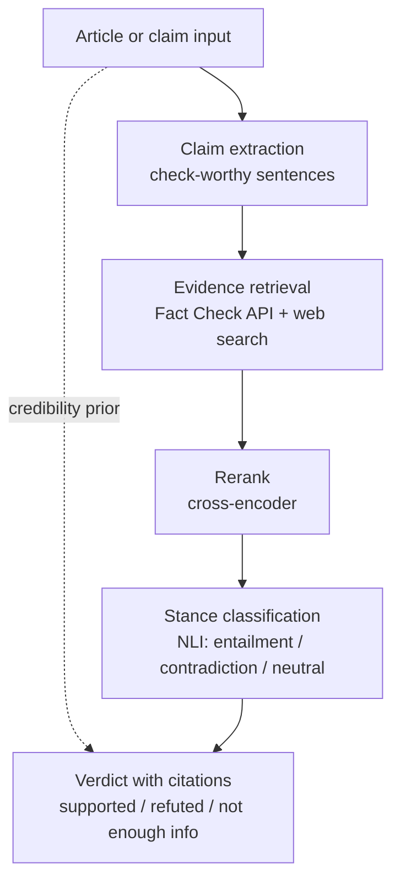

# Debunker — evidence-based claim verification

A fake news tool that retrieves evidence and shows its work, rather than
guessing from writing style.

**Thesis:** you cannot determine whether a claim is true by examining how it is
written. Weekend 1 of this project is a documented failure analysis proving that
point on the field's most-used benchmark. The remaining phases build the
retrieval-based system that the failure motivates.

---

## Status

| Phase | Deliverable | State |
|---|---|---|
| 1 | Baseline classifier + falsification suite | **Complete** |
| 2 | Fact Check API retrieval | **Complete** |
| 3 | Web search + NLI stance model | **Core complete** (gate calibration → Phase 4) |
| 4 | FEVER evaluation harness | **Complete** |
| 5 | Streamlit interface | Not started |

---

## Target architecture



This is the standard three-stage claim-verification pipeline from the automated
fact-checking literature — document retrieval, evidence selection, verdict
prediction — with the trained classifier demoted to a triage signal rather than
a source of verdicts.

**Planned components**

| Stage | Choice |
|---|---|
| Article extraction | `trafilatura` |
| Fact-check corpus | Google Fact Check Tools API (free, API key only) |
| Web evidence | Tavily (1,000 free credits/month), provider-swappable |
| Reranker | `cross-encoder/ms-marco-MiniLM-L-6-v2` |
| Stance | `MoritzLaurer/DeBERTa-v3-base-mnli-fever-anli` |
| Triage prior | LIAR-trained TF-IDF + logistic regression |

---

## Phase 1 — results

### Datasets

| Dataset | Size | Notes |
|---|---|---|
| ISOT | 21,417 real / 23,481 fake | Kaggle, `clmentbisaillon/fake-and-real-news-dataset` |
| LIAR | 10,269 train / 1,267 test | UCSB v1.0, 6 labels collapsed to binary |

`load_dataset("ucsbnlp/liar")` no longer works — the repo still ships a Python
loading script and recent versions of `datasets` refuse to execute it. Use the
raw TSVs.

### 1.1 The headline number

TF-IDF (50k features, 1–2 grams) + logistic regression on `title + text`:

```
train: 35,918   test: 8,980   fake rate: 0.523
accuracy: 0.9938

              precision  recall  f1     support
real          0.992      0.995   0.993  4284
fake          0.996      0.993   0.994  4696

confusion matrix
[[4263   21]
 [  35 4661]]
```

By the standards of most published tutorials, this is a finished project.

### 1.2 What the model actually learned

| Pushes toward "real" | Weight | Pushes toward "fake" | Weight |
|---|---|---|---|
| `reuters` | −23.50 | `video` | +10.43 |
| `said` | −13.10 | `just` | +6.25 |
| `washington reuters` | −9.70 | `read` | +5.82 |
| `president donald` | −5.52 | `image` | +5.76 |
| `washington` | −5.31 | `obama` | +5.65 |
| `wednesday` | −5.13 | `featured image` | +5.63 |
| `tuesday` | −4.63 | `watch` | +5.11 |
| `thursday` | −4.48 | `gop` | +5.07 |
| `nov`, `friday`, `monday` | ~−3.8 | `hillary`, `com`, `getty` | ~+4.2 |

Ten of the top fifteen "real" features are publisher metadata or calendar
tokens. The "fake" side is largely **HTML scraping residue** — `getty`,
`featured image`, `com` are image credits and embed captions that survived the
crawler. Several features (`obama`, `hillary`, `gop`) reflect topic and
time-period drift between the two corpora rather than anything about veracity.

Note the magnitude: `reuters` at −23.5 is nearly double the next feature.

### 1.3 Leak inventory

Four independent shortcuts, each sufficient on its own:

| # | Leak | Measurement |
|---|---|---|
| 1 | Reuters dateline | `(Reuters)` in **99.21%** of real, **0.04%** of fake |
| 2 | Subject taxonomy | Disjoint vocabularies, zero overlap |
| 3 | Headline capitalization | Capitalized-word fraction: **0.268** real vs **0.954** fake |
| 4 | Headline diction | 0.9017 accuracy from 40 characters |

**Subject values** — real: `politicsNews`, `worldnews`. Fake: `News`,
`politics`, `Government News`, `left-news`, `US_News`, `Middle-east`.
This column is deliberately excluded from training; tutorials that include it
are reporting accuracy on a lookup table.

**The one-line baseline.** A single substring check:

```python
pred = (~df['text'].str.contains(r'\(Reuters\)')).astype(int)   # 0.9960
```

**0.9960 — higher than the trained 50,000-feature model.** No parameters, no
vectorizer, no training.

### 1.4 Ablations: the leaks cannot be patched

| Attack | Accuracy | Δ from baseline |
|---|---|---|
| None | 0.9938 | — |
| Dateline stripped | 0.9879 | −0.0059 |
| Dateline + entire headline removed | 0.9873 | −0.0065 |

Removing the single strongest feature in the model cost **half a percentage
point**. Removing three of four known leaks simultaneously cost **0.65 points**.

This is the central structural finding. **Large coefficients indicate
preference, not dependence.** When features are redundant, knocking out the
favourite simply causes the model to fall back on the others. The separability
does not live in any nameable artifact — it lives in the fact that `True.csv`
is one scraper's output from one wire service and `Fake.csv` is another
scraper's output from a set of blogs. Sentence length, punctuation habits,
quotation conventions, number formatting, topic distribution: everything
differs. The corpus-identity signal is diffuse and inexhaustible.

### 1.5 Cross-dataset transfer

| Condition | Accuracy |
|---|---|
| Trained ISOT → tested LIAR | **0.4474** |
| LIAR majority-class baseline | 0.5666 |
| Lift over majority | **−0.1193** |
| Same architecture trained natively on LIAR | **0.6009** (+0.034 over baseline) |

Transfer accuracy (0.4474) sits almost exactly at LIAR's fake rate (0.4334) —
the signature of a model predicting "fake" for nearly everything. It learned
"Reuters wire copy = real," and no PolitiFact statement resembles Reuters wire
copy, so every LIAR item is out of distribution in the same direction. The model
did not transfer poorly; it did not transfer at all.

The native LIAR result is the controlled comparison. Same vectorizer, same
classifier, same binary task, same code — **+3.4 points over baseline**. That
is the entire value of text-only style classification when true and false
statements come from the same source, in the same register, often from the same
speaker.

**0.9938 on ISOT versus +3.4 points on LIAR. The only variable was the corpus.**

### 1.6 Style/truth mismatch

Six hand-written statements, style deliberately crossed against veracity,
scored by the ISOT-trained model and sorted by `p(fake)`:

| p(fake) | Statement | Truth | Verdict |
|---|---|---|---|
| 0.01 | `BRUSSELS (Reuters) -` summit resumes Thursday | true | correct |
| 0.02 | `WASHINGTON (Reuters) -` bleach cures respiratory infections | **false** | **miss** |
| 0.72 | Great Wall visible from the Moon | false | correct |
| 0.77 | Vaccines cause autism | false | correct |
| 0.78 | Earth orbits the Sun once every 365.25 days | **true** | **miss** |
| 0.95 | SHOCKING: Scientists CONFIRM the Earth orbits the Sun | **true** | **miss** |

Score: 3/6. The aggregate is the least interesting part — **the ordering sorts
perfectly by presence of a dateline and not at all by truth.**

Two cases carry the argument:

**The bleach statement.** Content recommending a lethal practice scored **0.02
probability of being fake** — the model's second-most-confident "real" verdict
in the set. The dateline made it *more* certain the claim was legitimate. The
exploitable feature is eight characters long and anyone can type it.

**The two orbit statements.** One of the most verified facts in science, phrased
twice. Plain: 0.78 fake. Tabloid: 0.95 fake. A 17-point swing on a statement
whose truth value never changed. The output is a style score wearing a truth
label.

The two correct "fake" calls were right by accident — rated fake for the same
reason the true statements were: neither reads like Reuters.

---

## What phase 1 establishes

1. ISOT is not a fake-news dataset. It is a Reuters-versus-not-Reuters dataset.
2. Reported accuracy on it measures corpus provenance, not veracity.
3. The leaks are redundant, so no ablation repairs the benchmark.
4. Nothing learned there transfers to a corpus where both classes share a source.
5. On such a corpus, text-only classification is worth roughly 3 points.
6. The failure mode is a safety problem, not just a benchmarking one: a filter
   defeated by prepending `WASHINGTON (Reuters) - ` confers false confidence on
   exactly the content most worth catching.

Therefore: determining whether a claim is true requires retrieving evidence
about it. → phase 2.

---

## Phase 2 — results

Retrieval-only verification against the Google Fact Check Tools API. No machine
learning. Given a claim, `factcheck.py` queries the corpus of claims that
professional fact-checkers have already investigated and returns their verdicts,
normalized to SUPPORTED / REFUTED / UNCLEAR / NO_MATCH.

### Setup

The Claim Search API needs only an API key — no OAuth, no billing account.
Enable "Fact Check Tools API" in a Google Cloud project, create an API key,
restrict it to that single API, then:

```bash
export GOOGLE_FACTCHECK_KEY="your-key"
python factcheck.py "vaccines cause autism"
python factcheck.py --demo          # runs the six Phase 1 adversarial claims
```

### 2.1 The rating-normalization problem

The API returns, per claim, one or more `claimReview` records with a
`textualRating` field. **That field is free text, not an enum** — every
publisher writes their own. Real strings seen in testing:

- `"Flawed Paper"` (FactCheck.org)
- `"False"`, `"Pants on Fire"` (PolitiFact)
- `"Four Pinocchios"` (Washington Post)
- `"Vaccines do not cause autism, and an increase in diagnosis..."` (a full sentence)

Mapping this to a clean verdict is the one real piece of engineering in Phase 2.
`classify_rating()` uses ordered regex patterns and is deliberately
conservative: mixed/hedged ratings and anything unrecognized become UNCLEAR
rather than a guess. Known gaps, documented rather than hidden:

| Rating string | Mapped to | Correct? |
|---|---|---|
| `False`, `Pants on Fire`, `Flawed Paper` | REFUTED | yes |
| `True`, `Correct` | SUPPORTED | yes |
| `Mostly False` | UNCLEAR | conservative — arguably REFUTED |
| `Four Pinocchios` | UNCLEAR | **miss** — no keyword matches |
| `Scam` | UNCLEAR | **miss** — arguably REFUTED |

Rating vocabularies are unbounded, so this classifier needs ongoing tuning
against whichever publishers actually appear. The rate of UNCLEAR-by-
non-recognition is itself a metric worth tracking.

### 2.2 The six adversarial claims

The same six statements the Phase 1 style model failed on, now sent to real
fact-checkers:

| Claim | Style model (Phase 1) | Fact Check API (Phase 2) | Correct? |
|---|---|---|---|
| vaccines cause autism | style guess | REFUTED, 5 sources | yes |
| Great Wall from Moon | right by accident | REFUTED (Snopes) | yes |
| 2020 election stolen | — | REFUTED, 5 sources | yes |
| bleach cures infections | 0.02 fake (wrong) | NO_MATCH | honest gap |
| 5G spreads covid | — | REFUTED, 0.89 (diluted) | mostly |
| Earth orbits the Sun | 0.78 fake (wrong) | **REFUTED (inverted — wrong)** | **no** |

The vaccine claim returned five current fact-checks, one dated the same month as
the query. Where the Phase 1 model scored this on whether it *sounded* like
Reuters, Phase 2 reports what fact-checkers actually concluded.

### 2.3 The new failure mode

**The API does fuzzy TOPIC matching, not exact CLAIM matching.** Two rows above
are wrong for the same structural reason, and neither is a coding bug:

- **"the Earth orbits the Sun" → REFUTED.** A *true* statement labeled false.
  The query matched a USA Today review of a *different* claim — photos alleging
  the sun orbits the earth — and inherited its "False" rating. High word
  overlap, opposite meaning.
- **5G confidence diluted to 0.89.** One retrieved review — "China was the first
  place to have over 100,000 5G towers" — is a different claim entirely, but was
  swept into the same query and voted in the aggregate.

Phase 2 has no mechanism to check whether a retrieved fact-check actually
addresses the queried claim. Every REFUTED it emits is only trustworthy if a
human reads the matched `claim_text` and confirms it is the same claim.

**Design decision:** this failure is left unpatched on purpose. A cheap
lexical-overlap guard would catch the 5G intruder but *not* the Earth/Sun
inversion (high overlap, opposite meaning), fixing the easy half of the problem
while hiding the dangerous half. Relevance filtering — "is this evidence about
*this* claim, and in which direction" — is exactly what the Phase 3 NLI stage
does. The Earth/Sun pair is kept as the motivating before/after case for it.

### What phase 2 establishes

1. Retrieval delivers high-precision verdicts *conditional on* the matched claim
   being the same claim — a condition Phase 2 cannot itself verify.
2. Free-text ratings cannot be perfectly normalized; honest systems route the
   unrecognized to UNCLEAR and measure how often that happens.
3. The corpus can confirm a claim is false but rarely that it is true — nobody
   fact-checks true statements, so NO_MATCH is the common, correct answer for
   true claims and cannot be read as either verdict.
4. Topic-matching without a relevance check produces confident, inverted errors
   (Earth/Sun). → phase 3 NLI.

---

## Phase 3 — results

Phase 2 established that a fact-check should only count toward a verdict if it is
actually *about* the queried claim. Phase 3 attempts to enforce that with a
two-model pipeline: a relevance gate, then an NLI stance model. The gate is the
new component; the finding is that no off-the-shelf single signal implements it
cleanly.

### 3.1 The pipeline

```
evidence + claim
      -> RelevanceGate   (is this evidence about the claim at all?)  -> drop if not
      -> StanceModel     (NLI: entailment / contradiction / neutral) -> vote if clear
```

Only evidence that is *both* relevant *and* has a clear stance votes.
Implemented in `stance.py`; `decide_verdict()` checks relevance **first** and
returns IRRELEVANT before it ever inspects the stance score. Verdict/aggregation
logic is unit-tested without the models.

Stance model: `MoritzLaurer/DeBERTa-v3-base-mnli-fever-anli`, label map confirmed
on-device as `{0: entailment, 1: neutral, 2: contradiction}`.

### 3.2 The finding that reshaped the phase: stance ≠ relevance

The initial assumption was that off-topic evidence would register as NLI
*neutral*. It does not. NLI answers "if the premise is true, is the hypothesis
true?" — not "is this on topic?". Five off-topic climate reviews all scored
**contradiction ≈ 0.99** against "climate change is a hoax", because the model
knows climate change is real and scores anything consistent with that reality as
contradicting "hoax". The model's pretraining prior leaks into the stance label.

Consequence: relevance and stance are separate questions requiring separate
signals. Stance alone cannot gate.

### 3.3 The gate works structurally, but the signal is miscalibrated

Running the relevance-gated pipeline on the Phase 2 failure cases:

- **Earth/Sun** → SUPPORTED. Relevance +6.23, entailment 0.99. The Phase 2
  inversion is fixed.
- **Climate hoax** → the five off-topic distractors were gated out (relevance
  −9 to −11) despite contradiction ≈ 0.99. Phase 2's failure mode is gone.
- **But** the one *legitimate* rebuttal ("multiple independent temperature
  records confirm...") was also gated out at −5.53 — the gate filtered signal
  along with noise. Verdict came back NOT_ENOUGH_INFO when good evidence existed.

The default threshold (0.0) was a guess. This motivated calibration.

### 3.4 Calibration: no single signal separates cleanly

`calibrate_relevance.py` scores 18 hand-labeled (claim, evidence, is_relevant)
pairs across four claims, with relevance labeled **independently of stance**
(an on-topic rebuttal is relevant; an off-topic supporting fact is not). Two
candidate relevance signals, same labeled set:

| Signal | Best labelling accuracy | Fails on |
|---|---|---|
| Cross-encoder (ms-marco passage relevance) | **0.83** | reframed rebuttals — low lexical overlap |
| NLI (1 − neutral probability) | **0.67** | claims the model has priors on |

Both overlap; neither admits a clean threshold. Crucially, **they fail on
disjoint subsets**:

- The **cross-encoder** rewards lexical overlap, so rebuttals that *reframe* the
  claim ("temperature records", "97% consensus", "audits and recounts") score
  below distractors that *echo* its vocabulary ("voter turnout", "the moon
  orbits the earth"). Fact-checking wants the opposite: the best rebuttals often
  avoid the claim's own framing.
- The **NLI neutral-score** reflects the model's prior strength, not aboutness.
  Off-topic climate distractors scored as falsely relevant (the model has loud
  opinions on climate); a genuine but dryly-factual vaccine rebuttal ("the 1998
  study was retracted") sank to 0.25 (read as a neutral historical fact).

The retracted-study pair is the clearest case: cross-encoder +2.04 (correctly
relevant), NLI 0.25 (wrongly irrelevant). The signals **disagree on the same
pair and the cross-encoder is right** — complementary blind spots, not two
equally broken tools.

### What phase 3 establishes

1. A relevance gate is necessary: it demonstrably removes the confident
   off-topic votes Phase 2 could not (Earth/Sun fixed, climate distractors
   dropped).
2. NLI stance cannot double as the gate — its label leaks pretraining priors.
3. No single off-the-shelf relevance signal separates on-topic from off-topic
   cleanly. Cross-encoder (0.83) beats NLI-neutral (0.67) but both overlap, and
   they err on disjoint subsets.
4. The labeled set (18 hand-picked pairs, 3 of 4 claims ones the model has
   priors on) is large enough to *diagnose* signals but too small and too biased
   to *calibrate* a trustworthy threshold. Fitting a combiner to it would repeat
   the overfitting the project has avoided since Phase 1. → measure candidate
   gates on FEVER (Phase 4), where claims are diverse and the model has no
   special opinions.

**Interim setting:** because neither gate is surgical, `stance.py` keeps the gate
permissive and leans on stance confidence plus requiring multiple agreeing pieces
to carry a verdict, rather than trusting the gate to be precise. The principled
gate is deferred to Phase 4 evaluation.

---

## Phase 4 — results

The first evaluation on a labelled benchmark, and the phase that settles the
Phase 3 threshold question. Measures the **full pipeline** — retrieval, gate,
stance, aggregation — against FEVER, reporting per-class F1 on a held-out sample.

### 4.1 Scope: full-pipeline eval on FEVER, not gold-evidence

FEVER labels claims Supported / Refuted / NotEnoughInfo against Wikipedia. Two
evaluation designs were considered:

- **Gold-evidence** — feed the pipeline FEVER's annotated evidence sentences and
  measure only the stance layer. *Abandoned*: the parquet conversion of
  `labelled_dev` flattened `evidence_sentence_id` to −1 for every row, losing the
  sentence-level pointer. Only page titles survive, so gold evidence cannot be
  resolved to text from this source without the full Wikipedia dump.
- **Full pipeline (chosen)** — retrieve evidence from the project's *own* sources
  (Fact Check API + Tavily web search), run the gate + stance + aggregation, and
  score against FEVER's labels. This measures the system as it actually works.
  It conflates retrieval and stance quality, but for *this* pipeline that is fair:
  retrieval is part of the system.

Loading note: `fever/fever` still ships a loading script, so `load_dataset` fails
on `datasets ≥ 4.5` (same wall as LIAR). Fixed by reading the auto-converted
parquet file directly by path (`fever_load.py`).

### 4.2 Method

`fever_eval.py`: stratified sample (equal per label, fixed seed), retrieve from
both sources, clean evidence to prose (drop infobox/table rows), run through the
relevance gate + NLI stance, aggregate, map the pipeline's verdict vocabulary to
FEVER's three labels, score per class.

**Threshold tuning, honestly.** The Phase 3 relevance threshold (−6.0) was a
guess. A 30-claim tuning run (seed 42) compared it against 0.0:

| threshold | accuracy | SUPPORTS F1 | REFUTES F1 | NEI F1 |
|---|---|---|---|---|
| −6.0 | 0.600 | 0.783 | 0.600 | 0.353 |
| 0.0 | **0.700** | 0.818 | 0.667 | **0.600** |

0.0 was strictly better — NEI F1 nearly doubled with no cost to the other
classes, because tighter gating dropped tangential evidence that had been voting
on NEI claims. **The final run uses a different seed (7)** so the reported numbers
are on claims the threshold was *not* tuned on.

### 4.3 Headline result (300 claims, seed 7, held out)

```
                    prec    rec     f1   support
SUPPORTS           0.757  0.810  0.783     100
REFUTES            0.707  0.580  0.637     100
NOT ENOUGH INFO    0.523  0.580  0.550     100

overall accuracy: 0.657   (n=300)
```

```
confusion matrix (rows=gold, cols=pred)
                  SUPPORTS  REFUTES  NEI
SUPPORTS               81        1   18
REFUTES                 7       58   35
NOT ENOUGH INFO        19       23   58
```

The held-out NEI F1 (0.55) came in below the tuning-set figure (0.60), as
expected — the small gap indicates 0.0 was not badly overfit.

### 4.4 The honest-NEI result

Retrieval coverage was **300/300** — every claim got evidence, so no NEI
prediction is the accidental product of empty retrieval. Of 58 correct NEI
predictions, **all 58 were reasoned** (evidence retrieved, examined, and judged
insufficient), not default abstentions:

```
NEI predictions:        empty retrieval 0  |  reasoned 111
correct NEI:            58, of which reasoned 58   ->  honest-NEI rate 1.00
```

This is the metric a careless harness would hide by merging "abstained because
retrieval was empty" with "abstained because evidence didn't resolve the claim".
When this pipeline says NOT ENOUGH INFO, it means it.

### 4.5 Error structure

The mistakes are structured, not random:

- **SUPPORTS is strongest** (81/100). When evidence supports a claim, the
  pipeline finds it and commits.
- **REFUTES leaks into NEI** (35/100). Refutation often needs evidence to
  *directly* contradict; with `REQUIRE_MIN_VOTES = 2`, a single clean
  contradiction abstains rather than commits. The system is conservative under
  uncertainty.
- **NEI errors split** between SUPPORTS (19) and REFUTES (23) — partly genuine
  over-commitment (topically-relevant evidence read as a verdict), partly a
  benchmark artifact (see 4.6).

### 4.6 The open-web vs. FEVER-NEI mismatch

Hand-inspection of NEI errors (via `--inspect "NOT ENOUGH INFO" REFUTES`) found
that many are **not model errors at all**. FEVER's NEI means "the single
Wikipedia page shown to annotators did not verify this claim" — not "this claim
is unverifiable in principle." Examples where the pipeline predicted REFUTES on a
gold-NEI claim:

- *"Gaius Julius Caesar was born in 130 BC in Rome"* — web evidence gives 100 BC,
  correctly contradicting the claim.
- *"Finding Dory was directed by Harry S. Truman"* — web evidence gives Andrew
  Stanton, correctly contradicting.

Open-web retrieval resolves claims FEVER's single-page protocol left unverifiable.
These "errors" are the pipeline being *more* correct than the closed-corpus label
allows — a direct echo of the Phase 1 thesis: **the benchmark measures something
narrower than truth.** Some NEI errors are genuine over-commitment (tangential
evidence voting), but a meaningful fraction are this definitional mismatch.

### What phase 4 establishes

1. The full pipeline reaches **0.657 accuracy** on a held-out 300-claim FEVER
   sample, with the classic profile: SUPPORTS easiest, NEI hardest.
2. Relevance-gate threshold, tuned on a disjoint set and validated held-out, is a
   real lever: 0.0 beat −6.0 on every class. The Phase 3 "no clean threshold"
   result was on 18 biased pairs; on diverse FEVER claims a usable operating point
   exists.
3. **Honest-NEI rate 1.00**: every correct abstention is reasoned, none is an
   artifact of empty retrieval. Coverage 300/300 makes this measurable.
4. The system is precise when it commits and conservative under uncertainty
   (REFUTES→NEI leakage from the 2-vote rule).
5. A meaningful share of NEI "errors" are open-web verification succeeding where
   FEVER's single-page annotation could not — the benchmark, not the pipeline,
   is the limiting factor there.

---

## Repository

```
.
├── baseline.py             # phase 1: TF-IDF + logistic regression, ISOT/LIAR loaders
├── falsify.py              # phase 1: four falsification experiments
├── factcheck.py            # phase 2: Fact Check API retrieval + rating normalization
├── stance.py               # phase 3: relevance gate + NLI stance + aggregation
├── calibrate_relevance.py  # phase 3: relevance-signal separation analysis
├── fever_load.py           # phase 4: FEVER parquet loader (script-free)
├── web_search.py           # phase 4: Tavily web retrieval, cached
├── fever_eval.py           # phase 4: full-pipeline FEVER evaluation harness
├── debunker.py             # full retrieval pipeline scaffold
├── requirements.txt
├── .cache/factcheck/       # cached fact-check responses (gitignored)
├── .cache/web/             # cached web-search responses (gitignored)
└── data/
    ├── isot/{True.csv, Fake.csv}
    └── liar/{train.tsv, valid.tsv, test.tsv}
```

Add to `.gitignore`: `.cache/`, `.venv/`, `data/`, `models/`, `*.joblib`, and
any `.env`. Never commit the API key.

## Reproducing phase 1

```bash
python3 -m venv .venv && source .venv/bin/activate
pip install scikit-learn pandas numpy joblib

mkdir -p data/isot data/liar
kaggle datasets download -d clmentbisaillon/fake-and-real-news-dataset -p data/isot --unzip
curl -L -o liar.zip https://www.cs.ucsb.edu/~william/data/liar_dataset.zip
unzip liar.zip -d data/liar/

python baseline.py --dataset isot --data-dir data/isot
python baseline.py --dataset liar --data-dir data/liar

python falsify.py --isot-dir data/isot --only 1
python falsify.py --isot-dir data/isot --only 2
python falsify.py --isot-dir data/isot --liar-dir data/liar --only 3
python falsify.py --isot-dir data/isot --only 4
```

Save the triage prior for phase 3 — use the LIAR-trained model, which learned
something about claim register rather than about which scraper produced a file:

```bash
python baseline.py --dataset liar --data-dir data/liar --save models/liar_prior.joblib
```

## Reproducing phase 2

```bash
pip install requests
export GOOGLE_FACTCHECK_KEY="your-key"    # Google Cloud > Fact Check Tools API
python factcheck.py --demo
```

Responses cache to `.cache/factcheck/`; re-runs cost no API quota. Use
`--no-cache` to force a live call.

## Reproducing phase 3

```bash
pip install torch transformers sentence-transformers sentencepiece
python stance.py                 # relevance-gated stance on the Phase 2 cases
python calibrate_relevance.py    # cross-encoder vs NLI-neutral separation analysis
```

## Reproducing phase 4

```bash
pip install datasets
export GOOGLE_FACTCHECK_KEY="your-key"
export TAVILY_KEY="tvly-your-key"          # tavily.com, free tier

python fever_eval.py --per-label 10                              # tiny debug run
python fever_eval.py --per-label 100 --seed 7 --relevance-threshold 0.0  # headline run
python fever_eval.py --inspect "NOT ENOUGH INFO" REFUTES         # error analysis
```

Web responses cache to `.cache/web/`; re-runs and `--inspect` cost no credits.
The headline run is ~300 Tavily credits (within the free monthly tier).

---

## Caveats

Stated up front so a reviewer does not have to raise them.

- **The six adversarial cases are hand-written and hypothesis-driven.** They
  illustrate a failure mode; they do not measure it. The transfer and ablation
  results carry the evidential weight.
- **`p(fake)` values come from an uncalibrated logistic regression.** Treat them
  as rankings, not probabilities.
- **The 0.9960 one-line rule was scored on all 44,898 rows**, not the held-out
  split. The rule has no fitted parameters so there is nothing to overfit, but
  the comparison should be rerun on the identical test split before publication.
- **Deduplication has not yet been verified.** ISOT contains near-duplicate
  articles; if any straddle the train/test split, part of the 0.9938 is
  memorization. Hash the first 200 characters and re-run.
- **The capitalization leak was measured as a group mean, not converted to a
  threshold classifier.** Quantifying it as a standalone rule is still open.
- **LIAR's 6 ordinal labels were collapsed to binary** to make the ISOT
  comparison fair on class count. The 6-way task is harder and scores much
  lower; this choice is deliberate and should be stated in any writeup.
- **Phase 2's `classify_rating` is regex over free text.** It has documented
  misses (`Four Pinocchios`, `Scam` → UNCLEAR) and will need extending as new
  publishers appear. It is not a learned component.
- **Phase 2 verdicts are unvalidated for relevance.** A REFUTED can be inverted
  when the API matches a related-but-opposite claim (see the Earth/Sun case).
  Do not trust a Phase 2 verdict without reading the matched claim text; the
  Phase 3 NLI stage is what makes this safe.
- **The six-claim demo is an illustration, not a benchmark.** Phase 4 (FEVER)
  is where retrieval quality gets measured properly, with per-class F1.
- **Phase 4 evaluates on n=300.** Enough for a stable class profile and a held-out
  threshold check, not for tight confidence intervals. Numbers are indicative.
- **Retrieval and stance quality are conflated in Phase 4.** Full-pipeline scoring
  means a wrong verdict could be bad retrieval or bad stance. This is deliberate
  (retrieval is part of the system) but limits attribution of individual errors.
- **A share of Phase 4 NEI "errors" are FEVER-protocol artifacts,** not model
  errors — open-web evidence resolves claims FEVER marks unverifiable. The 0.657
  accuracy therefore understates the pipeline's real-world correctness by some
  amount; §4.6 has the argument but the fraction is not yet quantified by
  systematic adjudication.
- **The 0.0 relevance threshold was tuned on 30 claims (seed 42) and validated on
  300 (seed 7).** Held-out validation guards against gross overfitting, but a
  larger tuning set would give a more stable operating point.

---

## Roadmap

**Phase 3 — evidence pipeline (core complete).** Relevance gate + NLI stance in
`stance.py`, with `calibrate_relevance.py` for signal analysis. Fixed the
Earth/Sun inversion; established that no single off-the-shelf relevance signal
gates cleanly (see Phase 3 results). Web search for the NO_MATCH cases (bleach
claim) and a principled combined gate remain, both gated on Phase 4 measurement.

**Phase 4 — evaluation (complete).** Full-pipeline FEVER evaluation in
`fever_eval.py`: 0.657 accuracy on a held-out 300-claim sample, honest-NEI rate
1.00, with the relevance threshold tuned on a disjoint set and validated held-out
(see Phase 4 results). Optional follow-ups: systematic adjudication of NEI errors
to quantify the FEVER-protocol-mismatch fraction, and testing `--min-votes 1` to
address REFUTES→NEI leakage.

**Phase 5 — interface.** Streamlit. Paste a URL, get claim-by-claim verdicts
with clickable sources.

**Design constraints carried forward**

- Cache every search response keyed by claim string. Free tiers are small and a
  retry loop can exhaust a month's quota in an afternoon.
- Never output a bare "FALSE". Output evidence and stance; let NOT ENOUGH INFO
  be a frequent, respectable answer.
- The classifier is a triage prior deciding what gets expensive retrieval —
  never a verdict.

---

## References

- Thorne et al. (2018), *FEVER: a large-scale dataset for Fact Extraction and VERification*
- Wang (2017), *"Liar, Liar Pants on Fire": A New Benchmark Dataset for Fake News Detection*, ACL
- Guo et al. (2022), *A Survey on Automated Fact-Checking*
- Google Fact Check Tools API — `developers.google.com/fact-check/tools/api`